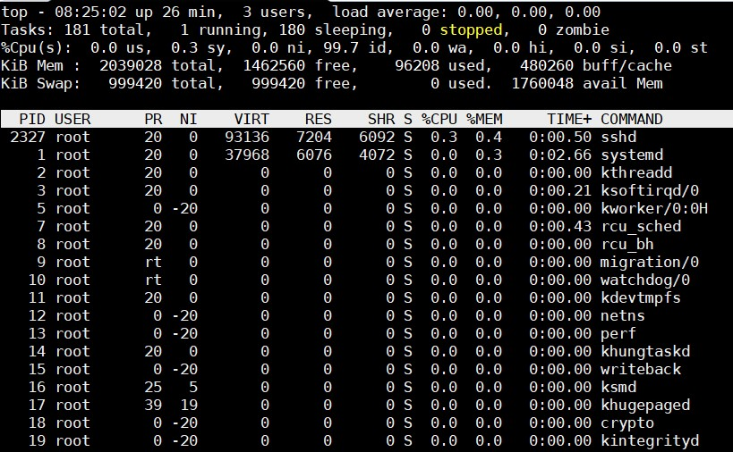
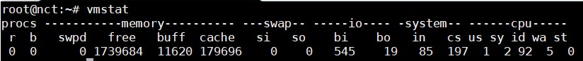
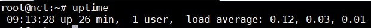
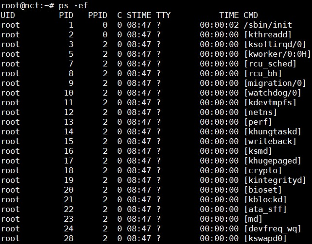
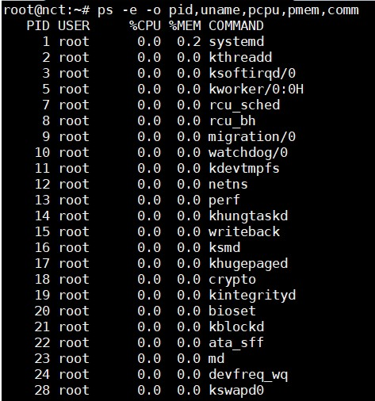
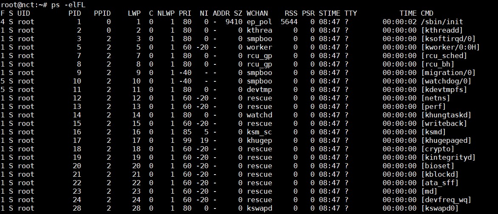
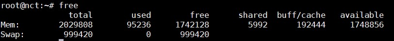
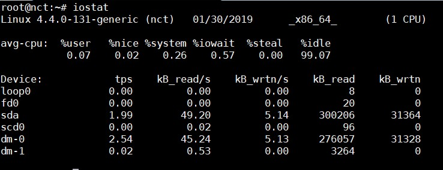
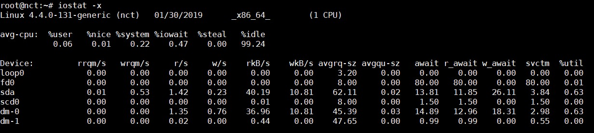
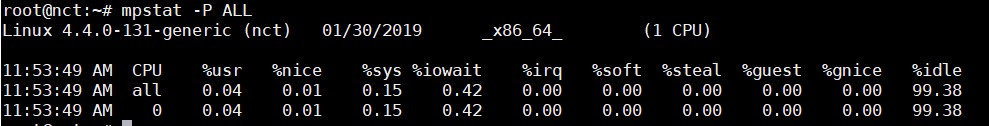

# Linux Monitoring tools

## 1. top

Lệnh `top` hiển thị hoạt động thực của các tiến trình. Theo mặc định, nó hiển thị các task chuyên sâu về CPU đang chạy trên máy chủ và cập nhật danh sách mỗi 5s. Bạn có thể sắp xếp các tiến trình theo PID, age, time, ...

Bạn có thể chỉnh sửa tiến trình bằng lệnh `renice` để thay đổi mức độ ưu tiên của mỗi tiến trình. Nếu một tiến trình chiếm dụng quá nhiều CPU, bạn có thể kill nó bằng lệnh `kill`.



Ý nghĩa các thông số lệnh `top` xem tại [đây](https://github.com/doedoe12/Internship/blob/master/Linux/parameter_meaning.md)

Tiện ích `top` hỗ trợ các hotkey sau:

- **t**: Bật tắt hiển thị các thông tin tổng quan

- **m**: Bật tắt hiển thị các thông tin về bộ nhớ

- **A**: Sắp xếp hiển thị top các tiến trình sử dụng theo các tài nguyên hệ thống cụ thể.

- **f**: Vào màn hình cấu hình cho `top`. Hiệu quả cho việc cấu hình `top` làm các task cụ thể.

- **o**: Cho phép chọn yêu cầu cho `top` 

- **r**: Sử dụng lệnh `renice`

- **k**: Sử dụng lệnh `kill`

## 2. vmstat

`vmstat` hiển thị các thông tin liên quan đến các tiến trình, bộ nhớ, paging, block I/O, traps, và hoạt động CPU. Lệnh `vmstat` hiển thị cả dữ liệu trung bình hoặc dữ liệu thực.



- **Process (procs)**: 

	- **r**: Số tiến trình đang đợi runtime
	
	- **b**: Số tiến trình trong trạng thái uninterruptable sleep
	
- **Memory**: 

	- **swpd**: Dung lượng bộ nhớ ảo sử dụng (KB)
	
	- **free**: Dung lượng bộ nhớ không hoạt động (KB)
	
	- **buff**: Dung lượng bộ nhớ sử dụng cho buffers (KB)
	
	- **cache**: Dung lượng bộ nhớ dùng cho cache (KB)
	
- **Swap**:

	- **si**: Dung lượng bộ nhớ được swap từ disk (KBps)
	
	- **so**: Dung lượng bộ nhớ được swap tới disk (KBps)
	
- **IO**:

	- **bi**: Block được gửi tới một block device (blocks/s)
	
	- **bo**: Block được nhận từ một block device (blocks/s)
	
- **System**:

	- **in**: Số lượng interrupt mỗi giây, gồm cả clock
	
	- **cs**: Số lượng context switch mỗi giây 
	
- **CPU (% of a total CPU time)**

	- **us**: Thời gian chạy non-kernel mode (user time, gồm cả nice time)
	
	- **sy**: Thời gian chạy kernel mode (system time)
	
	- **id**: Thời gian không hoạt động
	
	- **wa**: Thời gian đợi I/O
	
#### Một vài tuỳ chọn cho `vmstat` 

- **-m**: Hiển thị sử dụng bộ nhớ của kernel (slabs)

- **-a**: Cung cấp thông tin về active và inactive memory pages.

## 3. uptime



Lệnh `uptime` dùng để xem thời gian máy chủ đã chạy, số lượng user đang logon, và load average của hệ thống trong 1/5/15 phút.

## 4. ps and pstree

`ps` và `pstree` là câu lệnh đơn giản để phân tích hệ thống. `ps` có 3 kiểu: UNIX style, BSD style, GNU style. Ở đây chúng ta dùng UNIX style.

- **ps -ef**: Hiển thị tất cả các process đang chạy



Để hiển thị thêm thông tin chi tiết về các process thì thêm tuỳ chọn **-f** (ps -ef -f)

- **ps -f -u user1,user2,...**: Hiển thị các process theo user

- **ps -C name**: Hiển thị các process theo tên

- **ps -f -p ID**: Hiển thị các process theo ID 

- **ps aux -sort=-pcpu,+pmem**: Hiển thị thông tin process và sắp xếp theo %CPU, %MEM (- là sắp xếp theo giảm dần, + là tăng dần)

- **ps -e -o pid,uname,pcpu,pmem,comm**: Hiển thị các cột PID, USER, %CPU, %MEM, COMMAND



- **ps -e -o pid,comm,etime**: Hiển thị thời gian process đã chạy 

Ví dụ hiển thị đầy đủ của lệnh `ps`:



| Thông số | Miêu tả |
|----------|---------|
| F | Process flag |
| S | Trạng thái của Process: S=sleeping, R=running, T=stopped, D=interruptable sleep, Z=zombie |
| UID | Tên của user sở hữu process |
| PID | Process ID |
| PPID | Parent process ID |
| LWP | Light weight process ID |
| C | CPU sử dụng của process |
| NLWP | Số lượng lwp (threads) trong process |
| PRI | Mức độ ưu tiên của process |
| NI | Niceness level |
| ADDR | Process Address space (không hiển thị) |
| SZ | Số lượng bộ nhớ (code+data+stack) được dùng bởi process tính theo kilobytes |
| WCHAN | Tên của kernel function nơi mà process đang sleeping |
| RSS | Bộ nhớ vật lý non-swapped mà một task sử dụng tính theo kilobytes |
| PSR | Processor đang xử lý process |
| STIME | Thời gian câu lệnh bắt đầu |
| TTY | Terminal |
| TIME | Tổng thời gian sử dụng CPU của process (từ lúc bắt đầu) |
| CMD | Câu lệnh sử dụng để bắt đầu task (gồm cả tham số) |

## 5. free 

Lệnh `free` hiển thị thông tin về tổng dung lượng bộ nhớ trống và bộ nhớ đã dùng (gồm cả swap) trên hệ thống. Nó cũng bao gồm thông tin về buffers và cache dùng bởi kernel.



Sử dụng các tuỳ chọn **-b**,**-k**,**-m**,**-g** để hiển thị theo bytes, kilobytes, megabytes,gigabytes.

- **total** = used + buff/cache + free 

- **used**: Tổng dung lượng RAM đã sử dụng 

- **free**: Tổng dung lượng RAM còn trống 

- **shared**: Bộ nhớ chia sẻ giữa các tiến trình, bộ nhớ đang sử dụng như bộ đệm bởi kernel.

- **buff/cache**: Vùng lưu trữ tạm. Một số đặc điểm:

	- Mục đích của cache là tạo ra một vùng nhớ tốc độ cao để tăng tốc quá trình đọc/ghi file ra disk, buffer là tạo ra một vùng nhớ tạm có tốc độ bình thường để gom dữ liệu hoặc giữ dữ liệu để dùng sau.
	
	- Cache được tạo từ static RAM (SRAM) nên nhanh hơn buffer được tạo từ dynamic RAM (DRAM).
	
	- Buffer thường dùng cho các tiến trình I/O, trong khi cache chủ yếu dùng cho các tiến trình đọc/ghi file ra disk.
	
	- Cache có thể là một phần của đĩa (đĩa có tốc độ cao) hoặc RAM, còn buffer chỉ là một phần của RAM.

- **Swap**: Được sử dụng khi dung lượng bộ nhớ vật lý (RAM) đầy. Nếu hệ thống cần nhiều tài nguyên bộ nhớ hơn và bộ nhớ RAM đã đầy.

## 6. iostat

`iostat` dùng để hiển thị CPU times trung bình từ khi hệ thống bắt đầu hoạt động (giống như `uptime`). Nó cũng đồng thời báo cáo về hoạt động của disk subsystem của máy chủ tại 2 phần: CPU utilization và device (disk) utilization. Tiện ích `iostat` là một phần của gói `sysstat`, nên cần cài đặt gói `sysstat` để sử dụng iostat.



Phần CPU utilization có 4 phần:

- **%user**: %CPU sử dụng tại user level (applications).

- **%nice**: %CPU sử dụng tại user level với một mức ưu tiên nice.

- **%sys**: %CPU sử dụng tại system level (kernel)

- **%idle**: %CPU không hoạt động

Phần device utilization có các phần:

- **Device**: Tên của block device

- **tps**: Số lượng transfers mỗi giây (I/O requests per second) tới thiết bị. Nhiều single I/O requests có thể hợp lại thành một transfer request, vì một transfer request có thể có dung lượng khác nhau.

- **Blk_read/s, Blk_wrtn/s**: Số lượng block được đọc và ghi mỗi giây từ/tới thiết bị.

- **Blk_read, Blk_wrtn**: Tổng số block đã đọc, ghi từ khi khởi động hệ thống.

`iostat` có thể sử dụng với nhiều option. Hữu dụng nhất về quan điểm hiệu năng là option `-x`.



- **rrqm/s, wrqm/s**: Số yêu cầu đọc ghi được nhập gửi tới thiết bị mỗi giây. Nhiều yêu cầu I/O đơn có thể nhập thành một yêu cầu transfer.

- **r/s, w/s**: Số yêu cầu đọc/ghi được gửi tới thiết bị mỗi giây 

- **rsec/s, wsec/s**: Số sector đọc/ghi từ thiết bị mỗi giây.

- **rkB/s, wkB/s**: Số kilobytes đọc/ghi từ thiết bị mỗi giây.

- **avgrq-sz**: Kích cỡ trung bình của các yêu cầu được cấp cho thiết bị. Giá trị này hiển thị trong sectors.

- **avgqu-sz**: Độ dài hàng chờ trung bình của yêu cầu được cấp cho thiết bị

- **await**: Hiển thị %CPU được sử dụng khi thực thi tại system level (kernel)

- **svctm**: Service time trung bình (milisecond) cho I/O request được cấp cho thiết bị.

- **%util**: %CPU time I/O request được cấp cho thiết bị (băng thông cho thiết bị). Sự bão hoà thiết bị xảy ra khi giá trị này gần tới 100%.

## 7. sar

`sar` sử dụng để thu thập, báo cáo và lưu thông tin hoạt động của hệ thống. Lệnh `sar` bao gồm 3 ứng dụng: 

- `sar` dùng để hiển thị dữ liệu

- `sa1`, `sa2` để thu thập và lưu trữ dữ liệu. 

`sar` có rất nhiều các option, và `sar` cũng là một phần của gói `sysstat`.

Với `sa1` và `sa2`, hệ thống có thể được cấu hình để lấy thông tin và log để phân tích sau. Để thực hiện việc này, thêm vào file `/etc/crontab`. Ví dụ:

```
# 8am-7pm activity reports every 10 minutes during weekdays.
*/10 8-18 * * 1-5 /usr/lib/sa/sa1 600 6 &
# 7pm-8am activity reports every an hour during weekdays.
0 19-7 * * 1-5 /usr/lib/sa/sa1 &
# Activity reports every an hour on Saturday and Sunday.
0 * * * 0,6 /usr/lib/sa/sa1 &
# Daily summary prepared at 19:05
5 19 * * * /usr/lib/sa/sa2 -A &
```

Mặc định cron job chạy sar hàng ngày đã được cài đặt tự động sau khi cài đặt `sar` vào hệ thống.

Dữ liệu của `sar` được lưu tại `/var/log/sa/` nơi có các file đại diện cho các ngày của tháng tương ứng.

Một số cách sử dụng `sar` thông dụng tham khảo tại [đây](https://www.thegeekstuff.com/2011/03/sar-examples/?utm_source=feedburner)

## 8. mpstat

`mpstat` là câu lệnh dùng để báo cáo hoạt động của từng CPU trên máy chủ multiprocessor. Các hoạt động toàn cầu trung bình của tất cả CPU cũng được báo cáo. `mpstat` là một phần của gói `sysstat`.

Tiện ích `mpstat` cho phép bạn hiển thị số liệu thống kê tổng thể mỗi hệ thống hoặc mỗi processor. `mpstat` cũng đồng thời cho phép tạo thống kê khi sử dụng chế độ lấy mẫu giống như `vmstat` với sampling frequency và sampling count.



## 9. numastat

Để sử dụng `numastat` cần cài đặt gói `numactl`

