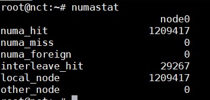

# Linux Monitoring tools

## 1. top

Lệnh `top` hiển thị hoạt động thực của các tiến trình. Theo mặc định, nó hiển thị các task chuyên sâu về CPU đang chạy trên máy chủ và cập nhật danh sách mỗi 5s. Bạn có thể sắp xếp các tiến trình theo PID, age, time, ...

Bạn có thể chỉnh sửa tiến trình bằng lệnh `renice` để thay đổi mức độ ưu tiên của mỗi tiến trình. Nếu một tiến trình chiếm dụng quá nhiều CPU, bạn có thể kill nó bằng lệnh `kill`.


Ý nghĩa các thông số lệnh `top` xem tại [đây](https://github.com/doedoe12/Internship/blob/master/Linux/parameter_meaning.md)

Tiện ích `top` hỗ trợ các hotkey sau:

- **t**: Bật tắt hiển thị các thông tin tổng quan

- **m**: Bật tắt hiển thị các thông tin về bộ nhớ

- **A**: Sắp xếp hiển thị top các tiến trình sử dụng theo các tài nguyên hệ thống cụ thể.

- **f**: Vào màn hình cấu hình cho `top`. Hiệu quả cho việc cấu hình `top` làm các task cụ thể.

- **o**: Cho phép chọn yêu cầu cho `top` 

- **r**: Sử dụng lệnh `renice`

- **k**: Sử dụng lệnh `kill`

## 2. vmstat

`vmstat` hiển thị các thông tin liên quan đến các tiến trình, bộ nhớ, paging, block I/O, traps, và hoạt động CPU. Lệnh `vmstat` hiển thị cả dữ liệu trung bình hoặc dữ liệu thực.


- **Process (procs)**: 

	- **r**: Số tiến trình đang đợi runtime
	
	- **b**: Số tiến trình trong trạng thái uninterruptable sleep
	
- **Memory**: 

	- **swpd**: Dung lượng bộ nhớ ảo sử dụng (KB)
	
	- **free**: Dung lượng bộ nhớ không hoạt động (KB)
	
	- **buff**: Dung lượng bộ nhớ sử dụng cho buffers (KB)
	
	- **cache**: Dung lượng bộ nhớ dùng cho cache (KB)
	
- **Swap**:

	- **si**: Dung lượng bộ nhớ được swap từ disk (KBps)
	
	- **so**: Dung lượng bộ nhớ được swap tới disk (KBps)
	
- **IO**:

	- **bi**: Block được gửi tới một block device (blocks/s)
	
	- **bo**: Block được nhận từ một block device (blocks/s)
	
- **System**:

	- **in**: Số lượng interrupt mỗi giây, gồm cả clock
	
	- **cs**: Số lượng context switch mỗi giây 
	
- **CPU (% of a total CPU time)**

	- **us**: Thời gian chạy non-kernel mode (user time, gồm cả nice time)
	
	- **sy**: Thời gian chạy kernel mode (system time)
	
	- **id**: Thời gian không hoạt động
	
	- **wa**: Thời gian đợi I/O
	
#### Một vài tuỳ chọn cho `vmstat` 

- **-m**: Hiển thị sử dụng bộ nhớ của kernel (slabs)

- **-a**: Cung cấp thông tin về active và inactive memory pages.

## 3. uptime


Lệnh `uptime` dùng để xem thời gian máy chủ đã chạy, số lượng user đang logon, và load average của hệ thống trong 1/5/15 phút.

## 4. ps and pstree

`ps` và `pstree` là câu lệnh đơn giản để phân tích hệ thống. `ps` có 3 kiểu: UNIX style, BSD style, GNU style. Ở đây chúng ta dùng UNIX style.

- **ps -ef**: Hiển thị tất cả các process đang chạy


Để hiển thị thêm thông tin chi tiết về các process thì thêm tuỳ chọn **-f** (ps -ef -f)

- **ps -f -u user1,user2,...**: Hiển thị các process theo user

- **ps -C name**: Hiển thị các process theo tên

- **ps -f -p ID**: Hiển thị các process theo ID 

- **ps aux -sort=-pcpu,+pmem**: Hiển thị thông tin process và sắp xếp theo %CPU, %MEM (- là sắp xếp theo giảm dần, + là tăng dần)

- **ps -e -o pid,uname,pcpu,pmem,comm**: Hiển thị các cột PID, USER, %CPU, %MEM, COMMAND


- **ps -e -o pid,comm,etime**: Hiển thị thời gian process đã chạy 

Ví dụ hiển thị đầy đủ của lệnh `ps`:


| Thông số | Miêu tả |
|----------|---------|
| F | Process flag |
| S | Trạng thái của Process: S=sleeping, R=running, T=stopped, D=interruptable sleep, Z=zombie |
| UID | Tên của user sở hữu process |
| PID | Process ID |
| PPID | Parent process ID |
| LWP | Light weight process ID |
| C | CPU sử dụng của process |
| NLWP | Số lượng lwp (threads) trong process |
| PRI | Mức độ ưu tiên của process |
| NI | Niceness level |
| ADDR | Process Address space (không hiển thị) |
| SZ | Số lượng bộ nhớ (code+data+stack) được dùng bởi process tính theo kilobytes |
| WCHAN | Tên của kernel function nơi mà process đang sleeping |
| RSS | Bộ nhớ vật lý non-swapped mà một task sử dụng tính theo kilobytes |
| PSR | Processor đang xử lý process |
| STIME | Thời gian câu lệnh bắt đầu |
| TTY | Terminal |
| TIME | Tổng thời gian sử dụng CPU của process (từ lúc bắt đầu) |
| CMD | Câu lệnh sử dụng để bắt đầu task (gồm cả tham số) |

## 5. free 

Lệnh `free` hiển thị thông tin về tổng dung lượng bộ nhớ trống và bộ nhớ đã dùng (gồm cả swap) trên hệ thống. Nó cũng bao gồm thông tin về buffers và cache dùng bởi kernel.


Sử dụng các tuỳ chọn **-b**,**-k**,**-m**,**-g** để hiển thị theo bytes, kilobytes, megabytes,gigabytes.

- **total** = used + buff/cache + free 

- **used**: Tổng dung lượng RAM đã sử dụng 

- **free**: Tổng dung lượng RAM còn trống 

- **shared**: Bộ nhớ chia sẻ giữa các tiến trình, bộ nhớ đang sử dụng như bộ đệm bởi kernel.

- **buff/cache**: Vùng lưu trữ tạm. Một số đặc điểm:

	- Mục đích của cache là tạo ra một vùng nhớ tốc độ cao để tăng tốc quá trình đọc/ghi file ra disk, buffer là tạo ra một vùng nhớ tạm có tốc độ bình thường để gom dữ liệu hoặc giữ dữ liệu để dùng sau.
	
	- Cache được tạo từ static RAM (SRAM) nên nhanh hơn buffer được tạo từ dynamic RAM (DRAM).
	
	- Buffer thường dùng cho các tiến trình I/O, trong khi cache chủ yếu dùng cho các tiến trình đọc/ghi file ra disk.
	
	- Cache có thể là một phần của đĩa (đĩa có tốc độ cao) hoặc RAM, còn buffer chỉ là một phần của RAM.

- **Swap**: Được sử dụng khi dung lượng bộ nhớ vật lý (RAM) đầy. Nếu hệ thống cần nhiều tài nguyên bộ nhớ hơn và bộ nhớ RAM đã đầy.

## 6. iostat

`iostat` dùng để hiển thị CPU times trung bình từ khi hệ thống bắt đầu hoạt động (giống như `uptime`). Nó cũng đồng thời báo cáo về hoạt động của disk subsystem của máy chủ tại 2 phần: CPU utilization và device (disk) utilization. Tiện ích `iostat` là một phần của gói `sysstat`, nên cần cài đặt gói `sysstat` để sử dụng iostat.


Phần CPU utilization có 4 phần:

- **%user**: %CPU sử dụng tại user level (applications).

- **%nice**: %CPU sử dụng tại user level với một mức ưu tiên nice.

- **%sys**: %CPU sử dụng tại system level (kernel)

- **%idle**: %CPU không hoạt động

Phần device utilization có các phần:

- **Device**: Tên của block device

- **tps**: Số lượng transfers mỗi giây (I/O requests per second) tới thiết bị. Nhiều single I/O requests có thể hợp lại thành một transfer request, vì một transfer request có thể có dung lượng khác nhau.

- **Blk_read/s, Blk_wrtn/s**: Số lượng block được đọc và ghi mỗi giây từ/tới thiết bị.

- **Blk_read, Blk_wrtn**: Tổng số block đã đọc, ghi từ khi khởi động hệ thống.

`iostat` có thể sử dụng với nhiều option. Hữu dụng nhất về quan điểm hiệu năng là option `-x`.


- **rrqm/s, wrqm/s**: Số yêu cầu đọc ghi được nhập gửi tới thiết bị mỗi giây. Nhiều yêu cầu I/O đơn có thể nhập thành một yêu cầu transfer.

- **r/s, w/s**: Số yêu cầu đọc/ghi được gửi tới thiết bị mỗi giây 

- **rsec/s, wsec/s**: Số sector đọc/ghi từ thiết bị mỗi giây.

- **rkB/s, wkB/s**: Số kilobytes đọc/ghi từ thiết bị mỗi giây.

- **avgrq-sz**: Kích cỡ trung bình của các yêu cầu được cấp cho thiết bị. Giá trị này hiển thị trong sectors.

- **avgqu-sz**: Độ dài hàng chờ trung bình của yêu cầu được cấp cho thiết bị

- **await**: Hiển thị %CPU được sử dụng khi thực thi tại system level (kernel)

- **svctm**: Service time trung bình (milisecond) cho I/O request được cấp cho thiết bị.

- **%util**: %CPU time I/O request được cấp cho thiết bị (băng thông cho thiết bị). Sự bão hoà thiết bị xảy ra khi giá trị này gần tới 100%.

## 7. sar

`sar` sử dụng để thu thập, báo cáo và lưu thông tin hoạt động của hệ thống. Lệnh `sar` bao gồm 3 ứng dụng: 

- `sar` dùng để hiển thị dữ liệu

- `sa1`, `sa2` để thu thập và lưu trữ dữ liệu. 

`sar` có rất nhiều các option, và `sar` cũng là một phần của gói `sysstat`.

Với `sa1` và `sa2`, hệ thống có thể được cấu hình để lấy thông tin và log để phân tích sau. Để thực hiện việc này, thêm vào file `/etc/crontab`. Ví dụ:

```
# 8am-7pm activity reports every 10 minutes during weekdays.
*/10 8-18 * * 1-5 /usr/lib/sa/sa1 600 6 &
# 7pm-8am activity reports every an hour during weekdays.
0 19-7 * * 1-5 /usr/lib/sa/sa1 &
# Activity reports every an hour on Saturday and Sunday.
0 * * * 0,6 /usr/lib/sa/sa1 &
# Daily summary prepared at 19:05
5 19 * * * /usr/lib/sa/sa2 -A &
```

Mặc định cron job chạy sar hàng ngày đã được cài đặt tự động sau khi cài đặt `sar` vào hệ thống.

Dữ liệu của `sar` được lưu tại `/var/log/sa/` nơi có các file đại diện cho các ngày của tháng tương ứng.

Một số cách sử dụng `sar` thông dụng tham khảo tại [đây](https://www.thegeekstuff.com/2011/03/sar-examples/?utm_source=feedburner)

## 8. mpstat

`mpstat` là câu lệnh dùng để báo cáo hoạt động của từng CPU trên máy chủ multiprocessor. Các hoạt động toàn cầu trung bình của tất cả CPU cũng được báo cáo. `mpstat` là một phần của gói `sysstat`.

Tiện ích `mpstat` cho phép bạn hiển thị số liệu thống kê tổng thể mỗi hệ thống hoặc mỗi processor. `mpstat` cũng đồng thời cho phép tạo thống kê khi sử dụng chế độ lấy mẫu giống như `vmstat` với sampling frequency và sampling count.


## 9. numastat

Để sử dụng `numastat` cần cài đặt gói `numactl`



## 10. pmap

Lệnh `pmap` báo cáo số lượng bộ nhớ mà một hay nhiều tiến trình đang sử dụng. Bạn có thể sử dụng công cụ này để xác định processes trên máy chủ được cấp bao nhiêu bộ nhớ và lượng bộ nhớ này có gây nên hiện tượng memory bottlenecks không. Để biết thông tin chi tiết, sử dụng option `pmap -d` 

`pmap -d PID`

Ví dụ:


Một số thông tin quan trọng ở phía dưới cùng:

- **mapped**: Tổng lượng bộ nhớ mapped vào files để sử dụng trong tiến trình 

- **writable/private**: Lượng private address space tiến trình này đang sử dụng 

- **shared**: Lượng address space tiến trình này đang chia sẻ.

Bạn cũng có thể xem các address space nơi lưu các thông tin. Bạn có thể tìm thấy một sự khác biệt thú vị khi sử dụng lệnh `pmap` trên hệ thống 32 và 64bit.

## 11. netstat 

`netstat` là một trong những công cụ thông dụng nhất. Nếu bạn làm việc với network, bạn có thể thấy quen thuộc với công cụ này. Nó hiển thị rất nhiều thông tin liên quan đến network như socket usage, routing, interface, protocol, network statistic, ... Đây là một vào option cơ bản:

- **-a**: Hiển thị tất cả thông tin về socket

- **-r**: Hiển thị thông tin về routing 

- **-i**: Hiển thị số liệu thông kê về network interface

- **-s**: Hiển thị thống kê network protocol

Có rất nhiều các option hữu dụng khác. Tìm hiểu thêm tại man page.

Ví dụ thông tin socket:


- **Proto**: Giao thức được sử dụng bởi socket (tcp, udp, raw)

- **Recv-Q**: Số lượng bytes không được sao chép bởi chương trình người dùng kết nối tới socket này.

- **Send-Q**: Số lượng bytes không được máy chủ từ xa xác nhận.

- **Local Address**: Địa chỉ và số cổng của đầu cuối cục bộ của socket. Trừ khi option --numberic (-n) được sử dụng, địa chỉ socket được phân giải thành FQDN, và số cổng được dịch thành tên service.

- **Foreign Address**: Địa chỉ và số cổng của đầu cuối từ xa của socket 

- **State**: Trạng thái của socket. Vì không có trạng thái nào trong raw mode và thường không có trạng thái được sử dụng tại UDP, cột này có thể để trống.

## 12. iptraf

`iptraf` giám sát TCP/IP traffic và báo cáo theo thời gian thực. Nó hiển thị thống kê TCP/IP traffic theo từng session, theo interface, và theo giao thức. Tiện ích `iptraf` được cung cấp bởi gói `iptraf`.

`iptraf` báo cáo một số vấn đề sau:

- **IP traffic monitor**: Thống kê network traffic theo kết nối TCP 

- **General interface statistic**: Thống kê IP traffic theo network interface

- **Detailed interface statistic**: Thống kê network traffic theo giao thức

- **Statistical breakdowns**: Thống kê network traffic theo cổng TCP/UDP và theo kích cỡ gói 

- **LAN station monitor**: Thống kê network traffic theo địa chỉ Layer2

Cài đặt iptraf và theo dõi theo interface:

```
apt install iptraf-ng 
iptraf-ng -i <interface>
```

## 13. tcpdump/ethereal

`tcpdump` và `ethereal` sử dụng để bắt và phân tích network traffic. Cả 2 công cụ sử dụng thư viện **libpcap** để bắt gói tin. Chúng giám sát tất cả traffic trên một network adapter với promiscuous mode và bắt tất cả các frame mà adapter nhận được. Để bắt tất cả các gói, các lệnh này nên được thực thi với quyền super user. 

Bạn có thể dùng các công cụ này để tìm hiểu các vấn đề liên quan đến network. Bạn có thể tìm thấy TCP/IP retransmission, windows size scaling, name resolution problem, network misconfiguration, ... Lưu ý rằng các công cụ này chỉ có thể giám sát các frame network adapter nhận được, không phải toàn bộ network traffic.

Xem thêm bài viết của mình về `tcpdump` tại [đây](https://github.com/doedoe12/Internship/blob/master/Linux/tcpdump.md)

## 14. nmon

`nmon` là viết tắt của Nigel's Monitor, là một công cụ phổ biến để giám sát hiệu năng hệ thống Linux được phát triển bởi Nigel Griffiths. Một vài task có thể giám sát gồm processor utilization, memory utilization, run queue information, disks I/O statistic, network I/O statistic, paging activity, và process metrics.

Để chạy `nmon`, đơn giản là bật công cụ lên và chọn subsystem bằng cách gõ vào lệnh one-key của chúng. Ví dụ, để lấy thông tin CPU, memory, và disk statistic, chạy `nmon` và nhập **c m d**.

Một tính năng hữu ích của `nmon` là cho phép lưu lại thống kê hiệu năng sau khi phân tích và xuất file dạng CSV file. Output dạng CSV có thể được import vào các bảng tính để tính toán và tạo báo cáo dạng biểu đồ.

Ví dụ chạy `nmon` cho một giờ và cứ 30s thì snapshot một lần:

```
nmon -f -s 30 -c 120
```

Output của lệnh trên sẽ được lưu tại một text file ở thư mục hiện tại với tên `<hostname>_date_time.nmon` 

## 15. strace

Lệnh `strace` chặn và ghi lại các system call được gọi bởi một tiến trình, và các tín hiệu được nhận bởi một tiến trình. Đây là một công cụ chuẩn đoán, giới thiệu, gỡ lỗi hữu dụng. Quản trị viên hệ thống thấy nó có giá trị trong việc giải quyết các vấn đề với chương trình.

Để trace một process:

`strace -p <pid>`

**Chú ý**: Khi lệnh `strace` đang chạy chống lại một tiến trình thì hiệu suất của PID đó bị giảm đáng kể, chỉ nên chạy lệnh trong thời gian thu thập dữ liệu.

Ở đây có một cách sử dụng thú vị. Lệnh này báo cáo lượng thời gian đã tiêu thụ trong kernel của mỗi system call để thực thi một lệnh.

```
strace -c <command>
```


## 16. Proc file system 

`Proc file system` không thực sự là một file system, nhưng nó cực hữu dụng. Nó không được dự định để lưu dữ liệu; hơn thế nữa, nó cung cấp một interface tới kernel đang chạy. `proc file system` cho phép một người quản trị giám sát và thay đổi kernel. Hầu hết các công cụ đo lường hiệu suất trên Linux đều dựa trên thông tin được cung cấp bởi `/proc`.


Nhìn vào proc file system, chúng ta có thể phân biệt một số thư mục con phục vụ các mục đích khác nhau, nhưng vì hầu hết các thông tin trong thư mục proc không dễ để đọc được, bạn được khuyến khích sử dụng các công cụ như `vmstat` để hiển thị các số liệu thống kê khác nhau theo cách dễ đọc hơn. Lưu ý rằng thông tin chứa trong proc file system khác nhau theo kiến trúc hệ thống.

- Files in the /proc directory

Các tệp khác nhau trong thư mục gốc của Proc đề cập đến một số thống kê hệ thống thích hợp. Bạn có thể tìm thấy thông tin về các công cụ Linux như `vmstat` và `cpuinfo` tại đây như là nguồn của output của chúng.

- Numbers 1 to X

Các thư mục con trong này là các tiến trình đang chạy của hệ thống, tên thư mục là PID của tiến trình đó, và chứa các thông tin liên quan tới nó. Cấu trúc luôn bắt đầu từ PID 1.

- acpi

Cho biết advance configuration và power interface được hỗ trợ bởi các máy tính hiện đại nhất và các hệ thống notebook. Vì nó là công nghệ PC chính nên nó thường bị tắt trên các hệ thống máy chủ.

- bus

Là một thư mục con bao gồm thông tin về hệ thống con bus như PCI bus hoặc USB interface của các hệ thống tương tự

- irq

Thư mục con `irq` chứa thông tin về các interrupt trong một hệ thống. Mỗi thư mục con trong thư mục này đề cập tới một interrupt hoặc một attaced device như là network interface card. Trong thư mục con irq, bạn có thể thay đổi CPU affinity của một interrupt nhất định.

- net

Thư mục con này chứa một số lượng đáng kể các số liệu thống kê thô liên quan đến giao diện mạng của bạn, chẳng hạn như các gói phát đa hướng nhận được hoặc các tuyến trên mỗi giao diện.

- scsi

Thư mục này chứa thông tin về SCSI subsystem của hệ thống tương ứng, như attaced devices hoặc driver revision.

- sys 

Trong thư mục con sys, bạn tìm thấy các tham số kernel có thể điều chỉnh, chẳng hạn như hành vi của trình quản lý bộ nhớ ảo hoặc network stack.

- tty 

Thư mục con tty chứa thông tin về terminals ảo tương ứng của hệ thống và thiết bị vật lý nào được gắn vào hệ thống.