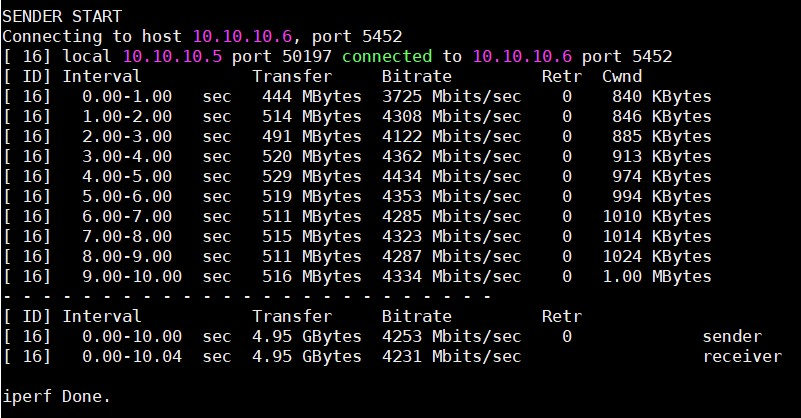

# Tìm hiểu về Bandwidth Test Controller (bwctl)

## Khái niệm

`bwctl` là một công cụ dòng lệnh sử dụng một loạt các công cụ đo lường network như iPerf, iPerf3, nuttcp, ping, traceroute, tracepath, và OWAMP để đo băng thông TCP tối đa với một loạt các tuỳ chọn điều chỉnh khác nhau như sự trễ, tỉ lệ mất gói tin,... Mặc định, bwctl sẽ dùng iPerf.

bwctl client sẽ liên lạc với một máy chủ để thực hiện bài test. bwctl server sẽ quản lí và sắp xếp các tài nguyên trên host mà nó chạy.

## Các tính năng chính

- Hỗ trợ iPerf, iPerf3 và nuttcp test.

- Hỗ trợ Ping test

- Hỗ trợ OWAMP (One-Way Latency) test 

- Hỗ trợ Traceroute và Tracepath test 

- Hỗ trợ IPv6 mà không cần thêm tuỳ chọn nào

- Dữ liệu giữa hai phía được trả lại để so sánh

- Không yêu cầu local bwctl server, bwctl client sẽ kiểm tra xem có local bwctl server không và sử dụng 

- Port ranges cho kết nối có thể được chỉ định 

- Giới hạn số lượng test có thể chạy 

**Yêu cầu**: bwctl yêu cầu NTP để đồng bộ thời gian của hai endpoint

## Các option phổ biến

| Option | Description |
|--------|-------------|
| -4, --ipv4 | Chỉ dùng IPv4 |
| -6, --ipv6 | Chỉ dùng IPv6 |
| -c, --receiver | Chỉ định host receive |
| -s, --sender | Chỉ định host sender |
| -T, --tool | Chỉ định tool sử dụng (iPerf, iPerf3, nuttcp) |
| -b, --bandwidth | Giới hạn băng thông với UDP |
| -l, --buffer_length | Độ dài của read/write buffers (bytes). Mặc định 8KB TCP, 1470 bytes UDP |
| -t, --test_duration | Thời gian cho bài test, mặc định là 10 giây |
| -u, --udp | Dùng UDP test, mặc định của bwctl là dùng TCP |
| -h, --help | Xem trợ giúp |
| -p, --print | In kết quả ra file | 
| -V, --version | Phiên bản |
| -P | Số luồng kết nối tới server |
| -w | Kích thước gói tin |
| --tester_port | Port để test, mặc định được chỉ định bởi công cụ sử dụng |

## Labs

### Cài đặt

- Cài đặt repo EPEL 

`yum install -y epel-release`

- Cài đặt Internet2 repo 

`rpm -hUv http://software.internet2.edu/rpms/el7/x86_64/main/RPMS/Internet2-repo-0.7-1.noarch.rpm`

- Refresh yum cache

`yum clean all`

- Cài đặt bwctl

`yum install -y bwctl`

- Cài đặt ntp

`yum install -y ntp`

- Chỉnh sửa file `/etc/ntp.conf` để hai host cùng trỏ về một ntp server 

`server vn.pool.ntp.org iburst`

- Khởi động lại dịch vụ ntp 

`systemctl restart ntpd`

- Kiểm tra 

`ntpq -p`

### Một số câu lệnh thông dụng 

`bwctl -s somehost.example.com`

Chạy test mặc định với TCP trong vòng 10 giây, máy chạy câu lệnh chính là receiver còn `somehost.example.com` là sender.

`bwctl -c -x somehost.example.com` 

Kết quả gần giống câu lệnh trên nhưng sẽ có thêm kết quả của phía receiver, và máy chạy câu lệnh là sender.

`bwctl -x -c somehost.example.com -s otherhost.example.com` 

Giống câu lệnh trên nhưng sender là `otherhost.example.com` 

`bwctl -t 30 -T iperf -s somehost.example.com` 

30 giây TCP iperf test với somehost.example.com là sender còn local là receiver

`bwctl -I 3600 -R 10 -t 10 -u -b 10m -s somehost.example.com` 

10 giây UDP test với sender rate là 10Mbits/sec từ somehost.example.com tới local 

## Tham khảo 

https://github.com/thaonguyenvan/meditech-thuctap/blob/master/ThaoNV/Tim%20hieu%20command/docs/bwctl.md
https://github.com/nguyenhungsync/Report-Intern-Meditech/blob/master/Test%20Command/3.%20bwctl.md
https://software.internet2.edu/bwctl/