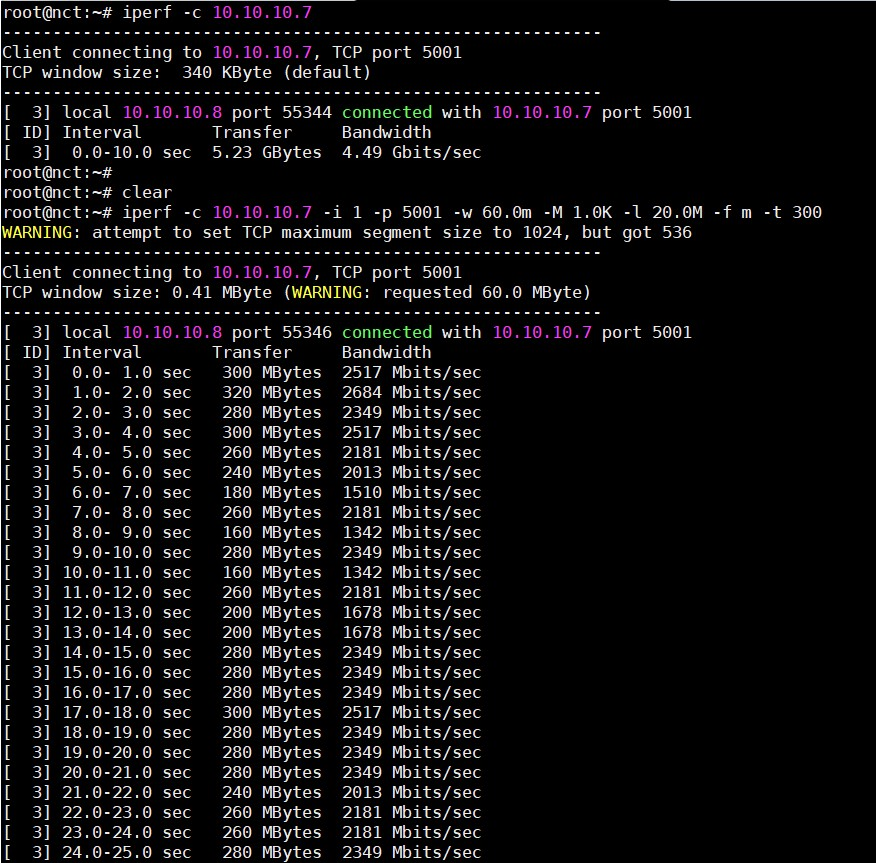

# Tìm hiểu về `iperf`

## Tổng quan

`Iperf` là một công cụ dùng cho việc đo lường tốc độ băng thông tối đa có thể đạt được trên các mạng IP. Nó hỗ trợ điều chỉnh các tham số khác nhau liên quan đến thời gian, bộ đệm và giao thức (TCP, UDP, SCTP, IPv4 và IPv6). Với mỗi lần test, nó sẽ cho ra các báo cáo về throughput/bitrate hay số package bị mất,...

`Iperf` hiện có 2 phiên bản là Iperf2 và Iperf3. Iperf3 đầu tiên được phát triển cho CentOS, FreeBSD và MacOS. Theo thời gian, nó dần hỗ trợ thêm một loạt các hệ điều hành khác như OpenBSD, NetBSD, Android, Solaris,...

Iperf3 được phát triển chủ yếu bởi ESnet/Lawrence Berkeley National Laboratory và tuân theo giấy phép three-clause BSD

## Những thay đổi giữa iperf2 và iperf3

### Các tính năng của iperf2 được hỗ trợ trên iperf3 

- Kiểm tra dựa trên giao thức TCP và UDP

- Đặt port 

- Thiết lập các TCP option: No delay, MSS,...

- Thiết lập băng thông cho UDP 

- Thiết lập kích thước bộ đệm socket

- Đặt khoảng thời gian báo cáo

- Thiết lập bộ đệm iperf

- Test IPv6 

- Số bytes để truyền

- Độ dài bài test 

- Các luồng song song 

- Thiết lập các vector DSCP/TOS

- Thay đổi định dạng output

### Các tính năng mới

- Dynamic server, hầu hết các server option trên iperf2 giờ có thể được set từ phía client

- Kết quả trả về của client/server có thể hoán đổi cho nhau

- iPerf API (libiperf), cung cấp API cho người dùng điều chỉnh các tính năng một cách dễ dàng hơn

- Đảo ngược trạng thái test, server sẽ gửi và client là người nhận

- Tuỳ chọn hiển thị thông tin output chi tiết hơn 

- Tuỳ chọn cho phép hiển thị output dưới dạng file json

- Đặt số lượng nhân của CPU

- Đặt số lượng block packet để truyền đi

- Tuỳ chọn cho phép chỉ sử dụng IPv4 hoặc IPv6 

- iPerf2 có thể xử lý 1 loạt các request nhưng iPerf3 sẽ chỉ xử lý 1 kết nối trong 1 thời điểm

### Các tính năng ở iPerf2 nhưng không có ở iPerf3

- Thử nghiệm 2 chiều (Bidirectional testing)

- Dữ liệu truyền từ stdin

- TTL: time-to-live

- Báo cáo dưới dạng các giá trị được ngăn cách nhau bởi dấu phẩy

## Các option phổ biến

### iPerf2 

| Option | Description |
|--------|-------------|
| -f, --format | Định dạng cho output. 'b'=bits/sec, 'B'=Bytes/sec,... |
| -i, --interval | Thời gian gửi báo cáo (mặc định là 0) |
| -l, --len | Buffer size |
| -p, --port | Port mà server lắng nghe và client kết nối tới, giống nhau ở client và server, mặc định là port 5001 |
| -u, --udp | Sử dụng UDP |
| -N, --nodelay | Sử dụng tuỳ chọn TCP no delay |
| -h, --help | Tóm tắt các tuỳ chọn có thể sử dụng |
| -n | Gửi n gói tin với kích thước l |

- Phía server 

| Option | Description |
|--------|-------------|
| -s, --server | Chạy iPerf ở mode server |
| -D (from v1.2 or higher) | Dùng server như một daemon |
| -R (only for Windows, from v1.2 or higher) | Loại bỏ hết các iperf service |
| -o (only for Windows, from v1.2 or higher) | Chuyển output sang 1 file |
| -c, --client | Giới hạn các connection được phép kết nối tới server, không dùng được với UDP |

- Phía client

| Option | Description |
|--------|-------------|
| -b, --bandwidth | Băng thông UDP, mặc định là 1 Mbit/sec |
| -c, --client | Chạy iPerf ở mode client |
| -d, --dualtest | Chạy dưới dạng dualtest |
| -n, --num | Số lượng buffers để truyền đi, mặc định thì iPerf gửi cho 10 giây |
| -t, --time | Thời gian truyền dữ liệu, mặc định là 10 giây | 
| -L, --listenport | Port mà server sẽ kết nối lại tới client |
| -P, --parallel | Số lượng connection kết nối tới server, mặc định là 1 |
| -T, --ttl | Sử dụng cho outgoing multicast packets |

### iPerf3

| Option | Description |
|--------|-------------|
| -p, --port | Port mà server lắng nghe và client kết nối tới, nên giống nhau ở cả hai đầu client và server. Mặc định là port 5201 |
| -f, --format | Định dạng cho output. 'k'=Kbit/sec, 'K'=KBytes/sec, 'm'=Mbits/sec, 'M'=MBytes/sec |
| -i, --interval | Thời gian mà iPerf gửi báo cáo cho bạn (mặc định là 0) |
| -A, --affinity | Đặt số lượng CPU core |
| -V, --verbose | Output hiển thị nhiều thông tin hơn |
| -J, --json | Output dưới dạng file json |
| --logfile | Gửi output tới logfile |
| -h, --help | Hiển thị tóm tắt các tuỳ chọn |
| -P | Đẩy nhiều luồng song song, phù hợp với stress testing, mặc định là 1 | 
| -B | Gán host/interface. Sử dụng khi máy có nhiều interface và bạn chỉ muốn test 1 |
| -n | Gửi n gói tin với kích thước l |

- Phía server 

| Option | Description |
|--------|-------------|
| -s, --server | Chạy iPerf ở mode server |
| -D | Dùng server như một daemon |

- Phía client 

| Option | Description | 
|--------|-------------|
| -c, --client | Chạy iPerf ở mode client |
| -u, --udp | Sử dụng UDP |
| -b, --bandwidth | Băng thông, mặc định là 1 Mbit/sec cho UDP, không giới hạn với TCP |
| -t, --time | Thời gian truyền dữ liệu, mặc định là 10 giây |
| -n, --num | Số lượng buffer để truyền đi, mặc định thì iPerf gửi cho 10 giây |
| -R, --reverse | Reverse mode, server gửi, client nhận |
| -4, --version4 | Chỉ dùng IPv4 |
| -6, --version6 | Chỉ dùng IPv6 | 

## Lab cài đặt và test băng thông mạng 

### Mô hình  

- Server: Ubuntu 16.04, IP: 10.10.10.7

- Client: Ubuntu 16.04, IP: 10.10.10.8

Để kiểm tra băng thông của mạng ta có thể sử dụng một trong hai giao thức TCP hoặc UDP. Cần một máy làm server để lắng nghe và 1 máy làm client kết nối tới server. iPerf sẽ tính toán và đưa ra được băng thông của mạng giữa server và client

Cài đặt iPerf bằng câu lệnh:

`apt-get install iperf` 

Đối với CentOS:

```
yum install epel-release
yum update
yum install iperf
```

### Sử dụng TCP

Cả 2 máy đều cần cài iperf. Nếu sử dụng tham số cổng `-p` thì trên cả server và client đều phải giống cổng nhau.

Trên server:

`iperf -s`

Trên client: 

`iperf -c 10.10.10.7`

Kết quả sau 10 giây:


- Ví dụ bài test TCP với buffer size: 20MB, Window Size: 60Mbps, Max segment size 5 trong thời gian 5 phút, kết quả hiển thị dưới dạng mbps

Server:

`iperf -s -P 0 -i 1 -p 5001 -w 60.0m -l 20.0M -f m`

Client:

`iperf -c 10.10.10.7 -i 1 -p 5001 -w 60.0m -M 1.0K -l 20.0M -f m -t 300`

Kết quả: 



### Sử dụng UDP 

Server:

`iperf -s -u`

Client:

`iperf -c 10.10.10.7 -u`

Kết quả:


- Ví dụ bài test UDP với Bandwidth 600Mbps Packet size 500 Bytes trong 100s

Server:

`iperf -s -u -P 0 -i 1 -p 5001 -f -m`

Client:

`iperf -c 10.10.10.7 -u -i 1 -p 5001 -l 500B -f m -b 600m -t 100`

Kết quả:


### Kiểm tra lưu lượng tối đa trên một card mạng có thể truyền tải được

Để làm việc này ta có thể đẩy tải liên tục bằng UDP tại máy chủ, do UDP truyền file mà không cần phải bắt tay 3 bước như TCP nên ta có thể đẩy UDP liên tục từ client, thay đổi băng thông và quan sát băng thông tối đa mà nó đạt được, đó cũng chính là giới hạn của card mạng.

Tiến hành kiểm tra card ens33 trên server 10.10.10.7

`iperf -c 192.168.226.1 -u -b 100m -t 20 -i 1`


Ta thấy dữ liệu gửi đi và băng thông ổn định, suy ra đây chưa phải lưu lượng tối đa có thể truyền tải. Ta tăng lượng lưu lượng truyền tải lên rồi tiếp tục kiểm tra.

`iperf -c 192.168.226.1 -u -b 500m -t 20 -i 1`


Tiếp tục tăng lưu lượng truyền tải tối đa lên 1g

`iperf -c 192.168.226.1 -u -b 1g -t 20 -i 1`


Tăng lên 2g

`iperf -c 192.168.226.1 -u -b 2g -t 20 -i 1`


Tăng tiếp lên 3g

`iperf -c 192.168.226.1 -u -b 3g -t 20 -i 1`


Ta thấy băng thông có vẻ đã đến giới hạn, đây chính là tốc độ tối đa của card mạng ens33 của mình

## Tham khảo

https://github.com/meditechopen/meditech-thuctap/blob/master/ThaoNV/Tim%20hieu%20command/docs/iperf.md

https://github.com/MinhKMA/meditech-thuctap/blob/master/MinhNV/Nagios/docs/l%C3%BD%20thuy%E1%BA%BFt/Ki%E1%BB%83m%20tra%20th%C3%B4ng%20s%E1%BB%91/iperf.md

https://iperf.fr/