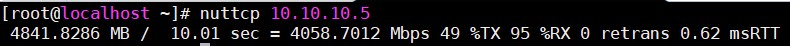
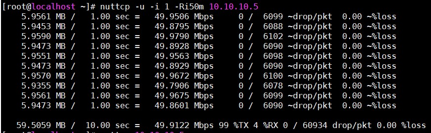
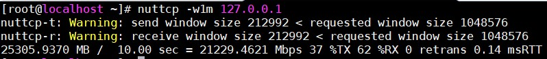

# Tìm hiểu `nuttcp`

## Khái niệm

Nuttcp là một công cụ đo lường hiệu năng mạng được sử dụng bởi các nhà quản lý mạng và hệ thống. Việc sử dụng cơ bản nhất của nó là xác định thông lượng mạng TCP (hoặc UDP) thô bằng cách truyền memory buffers từ một hệ thống nguồn qua mạng kết nối tới hệ thống đích, truyền dữ liệu cho một khoảng thời gian nhất định hoặc chuyển một số lượng cụ thể các bytes.

Ngoài việc báo cáo luồng dữ liệu đạt được trong Mbps, nuttcp cũng cung cấp thêm thông tin hữu ích liên quan đến việc truyền dữ liệu như người sử dụng, hệ thống, wall-clock time, mức độ sử dụng của CPU, tỷ lệ mất mát dữ liệu (đối với UDP).

Nuttcp dựa trên nttcp. Nttcp được nâng cấp từ ttcp. Ttcp được viết bởi Mike Muuss vào năm 1984 để so sánh hiệu năng của TCP stacks. Nuttcp có một số tính năng hữu ích ngoài các tính năng ttcp/nttcp cơ bản, chẳng hạn như chế độ máy chủ, tỷ lệ giới hạn, nhiều luồng song song và sử dụng bộ đếm thời gian. Những thay đổi gần đây bao gồm hỗ trợ IPv6, multicast IPv4 và khả năng thiết lập kích thước phân đoạn tối đa hoặc bit TOS/DSCP. Nuttcp đang tiếp tục phát triển để đáp ứng các yêu cầu mới phát sinh và để thêm các tính năng mới mong muốn. Nuttcp đã được xây dựng thành công và chạy trên nhiều hệ thống Solaris, SGI, và PPC/X86 Linux, và có thể hoạt động tốt trên hầy hết các distribution của UNIX. Nó cũng đã được sử dụng thành công trên các phiên bản khác nhau của hệ điều hành Windows.

## Các options chính

Nuttcp có 2 mode cơ bản:

- Classic Mode: Hoạt động mô hình transmitter/receiver, đây cũng chính là cách mà tccp, nttcp hoạt động. Để hoạt động mode này trước tiên cần khởi tạo ở host receiver bằng `nuttcp -r`, sau đó ở host transmitter cần phải thực hiện `nuttcp -t`. Hiện nay mode này không còn được khuyến nghị sử dụng.

- Client/Server Mode: Với mode này, server sẽ được start với câu lệnh `nuttcp -S` hoặc `nuttcp -1` và sau đó client có thể truyền dữ liệu `nuttcp -t` hoặc nhận dữ liệu `nuttcp -r` từ phía server. Tất cả các thông tin cung cấp bởi nuttcp sẽ được thông báo trên phía client.

| Options | Description |
|---------|-------------|
| -h | Xem trợ giúp |
| -V | Hiển thị thông tin về phiên bản |
| -t | Chỉ định máy transmitter |
| -r | Chỉ định máy receiver |
| -S | Chỉ định máy Server |
| -1 | Chỉ định máy Server |
| -b | Định dạng output theo kiểu one-line |
| -B | Buộc receiver phải đọc toàn bộ buffer |
| -s | Sử dụng input thay vì memory buffer để làm dữ liệu transfer |
| -u | Sử dụng UDP (mặc định là TCP) |
| -v | Cung cấp thêm thông tin |
| -w | Window size |
| -p | Port sử dụng để kết nối dữ liệu, mặc định là 5001 |
| -P | Với mode client/server, đây là port để kiểm soát kết nối, mặc định là 5000 |
| -n | Số lượng buffer |
| -N | Số lượng luồng dữ liệu truyền |
| -R | Tốc độ truyền |
| -l | Packet length |
| -T | Thời gian, mặc định là 10 giây |
| -i | Thời gian gửi báo cáo (giây) |

## Lab

### Cài đặt nuttcp:

Đối với CentOS, cần cài đặt EPEL repo trước rồi mới cài nuttcp bằng lệnh:

`yum install nuttcp` 

Đối với Ubuntu:

`apt-get install nuttcp`

Mở cổng kết nối 5000 và 5001 trên firewall

```
firewall-cmd --permanent --add-port=5000/tcp 
firewall-cmd --permanent --add-port=5001/tcp 
firewall-cmd --reload
```

### Một vài kịch bản test

- Gửi gói tin tcp trong 10 giây:

Server:

`nuttcp -S`

Client:

`nuttcp <serverhost>`

Kết quả:



%TX và %RX là mức độ sử dụng CPU trên transmitter và receiver.

- Truyền các gói tin UDP với tốc độ 50Mbps trong 10 giây và báo cáo mỗi giây. Thường dùng để test số lượng packet bị mất:

Server:

`nuttcp -S`

Client:

`nuttcp -u -i 1 -Ri50m <serverhost>`

Kết quả:



- Test tốc độ bên trong của host:

Client:

`nuttcp -w1m 127.0.0.1`

Kết quả:



## Tham khảo

https://fasterdata.es.net/performance-testing/network-troubleshooting-tools/nuttcp/
https://github.com/thaonguyenvan/meditech-thuctap/blob/master/ThaoNV/Tim%20hieu%20command/docs/nuttcp.md
https://github.com/nguyenhungsync/Report-Intern-Meditech/blob/master/Test%20Command/1.%20Nuttcp.md