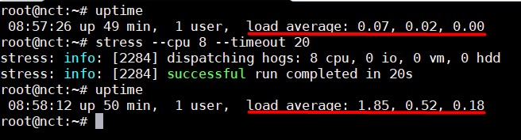
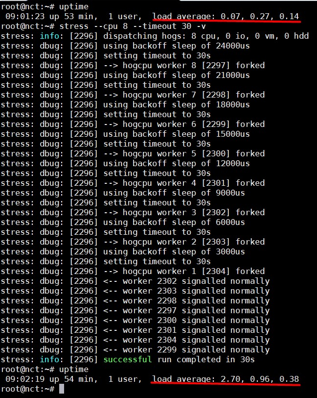
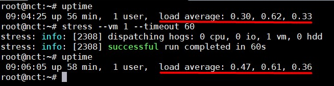
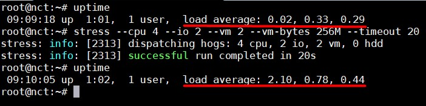
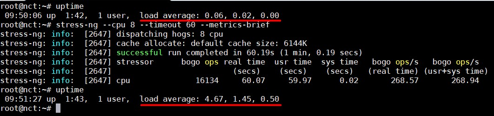
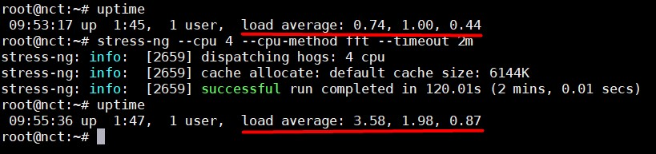
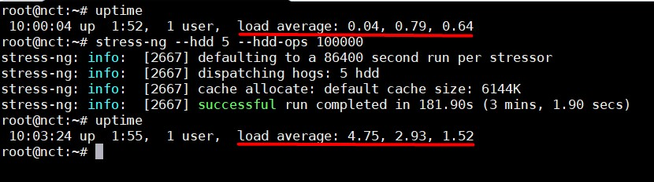
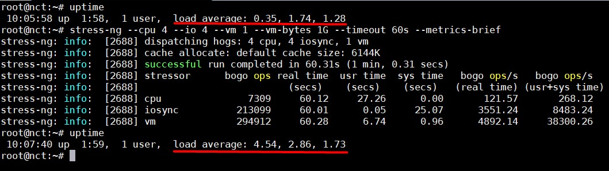

# Áp đặt High CPU Load và Stress Test trên Linux sử dụng công cụ `stress-ng`

Với tư cách là một người quản trị hệ thống, bạn có thể sẽ muốn kiểm tra và giám sát tình trạng của hệ thống Linux trong trường hợp mức tải của CPU vượt ra ngoài những cách thức sử dụng bình thường. Điều này sẽ giúp nhân viên quản trị hệ thống và lập trình viên:

- Điều chỉnh các hoạt động trên hệ thống

- Giám sát các interface của kernel

- Kiểm thử các thành phần phần cứng của Linux như CPU, RAM, disk,... để xem phản ứng của chúng khi ở những điểm cao bất thường 

- Đo điện năng tiêu thụ khác nhau tải trên một hệ thống 

Trong bài này, chúng ta sẽ sử dụng 2 công cụ là `stress` và `stress-ng` để kiểm tra hệ thống Linux.

- `stress`: Là công cụ tạo ra một khối lượng công việc để người dùng kiểm tra mức độ hoạt động dưới áp lực nhất định của CPU, RAM, và disk.

- `stress-ng`: Là phiên bản cập nhật của stress, nó có thể test được:

	- CPU compute
	
	- drive stress 
	
	- I/O syncs
	
	- Pipe I/O
	
	- cache thrashing
	
	- VM stress 
	
	- socket stressing 
	
	- process creation and termination
	
	- context switching properties
	
Dù những công cụ này rất hữu ích cho việc kiểm tra hệ thống, tuy nhiên nó không nên được sử dụng bởi bất cứ một user hệ thống nào. Tốt hơn hết chỉ cho phép user `root` được dùng để tránh việc hệ thống bị quá tải.

## stress 

Để cài đặt `stress` trên Ubuntu, sử dụng câu lệnh:

`apt-get install stress`

Đối với CentOS, cần cài đặt EPEL repo trước rồi cài đặt `stress` bằng câu lệnh:

`yum install stress`

Cấu trúc lệnh `stress`:

`sudo stress option argument`

Một số option của stress:

| Option | Description |
|--------|-------------|
| -cpu N | Tạo ra N công việc cho hàm sqrt() | 
| -io N | Tạo ra N công việc cho hàm sync() |
| -vm N | Tạo ra N công việc cho hàm malloc(), free() |
| -vm-bytes N | Phân bổ bộ nhớ cho mỗi công việc |
| -vm-keep | Thay vì giải phóng và phân bổ lại tài nguyên bộ nhớ, bạn có thể làm lại bộ nhớ bằng cách sử dụng tuỳ chọn này |
| -vm-hang N | Đặt thời gian sleep là N giây trước khi giải phóng bộ nhớ | 
| -hdd N | Tạo ra N công việc cho hàm write(), unlink() |
| -backoff N | Đặt khoảng thời gian đợi trước khi bắt đầu công việc theo microseconds | 
| timeout N | Đặt thời gian chờ sau N giây |
| -v | Hiển thị thêm thông tin chi tiết khi chạy stress |
| -help | Xem trợ giúp |

### Sử dụng stress 

1. Để kiểm tra tác động của câu lệnh, đầu tiên sử dụng `uptime` để xem mức độ tải trung bình của máy chủ. Sau đó tiến hành chạy lệnh stress để tạo ra 8 lượng công việc cho hàm sqrt() trong 20 giây. Cuối cùng sử dụng lại `uptime` để so sánh:

```
uptime
sudo stress --cpu 8 --timeout 20
uptime 
```

Ví dụ:



2. Tạo ra 8 công việc cho hàm sqrt() trong 30 giây và hiển thị thông tin chi tiết:

```
uptime 
sudo stress --cpu 8 -v --timeout 30
uptime 
```

Ví dụ:



3. Tạo ra 1 công việc cho hàm malloc() và free() trong 60 giây:

```
uptime 
sudo stress --vm 1 --timeout 60
uptime 
```

Ví dụ:



4. Tạo ra 4 công việc cho hàm sqrt(), 2 công việc cho sync(), 2 công việc cho malloc()/free() trong 20 giây và cấp 256MB bộ nhớ cho mỗi công việc:

```
uptime 
sudo stress --cpu 4 --io 2 --vm 2 --vm-bytes 256M --timeout 20
uptime 
```

Ví dụ:



## stress-ng 

Để cài đặt stress-ng, dùng lệnh:

```
apt-get install stress-ng #Cho hệ thống Debian based
yum install stress-ng 	  #Cho hệ thống RedHat based
```

Cấu trúc lệnh `stress-ng`:

`sudo stress-ng option argument` 

Một vài option của stress-ng:

| Option | Description |
|--------|-------------|
| -all N | Bắt đầu N ví dụ cho mỗi stress test |
| -cpu N | Bắt đầu N processes để thử nghiệm CPU bằng cách thực hiện tuần tự tất cả các method stress test CPU khác nhau |
| -cpu-method | Sử dụng một method stress test CPU, xem manpage để xem tất cả các method |
| -cpu-ops N | Dừng CPU stress proccess sau N bogo operations | 
| -io N | Bắt đầu N I/O stress testing processes |
| -io-ops N | Dừng CPU I/O stress processes sau N bogo operations |
| -vm N | Bắt đầu N vm stress testing proccesses |
| -vm-bytes N | Đặt bộ nhớ cho từng vm process |
| -vm-ops N | Dừng vm stress proccesses sau N bogo operations |
| -hdd N | Bắt đầu N harddisk exercising proccesses |
| -hdd-ops N | Dừng hdd stress proccesses sau N bogo operations |
| -timeout N | Đặt timeout sau N giây |
| -metrics, -metrics-brief | Tạo một báo cáo tóm tắt sau bogo operations |
| -dir N | Bắt đầu N proccesses sẽ tạo và xoá các thư mục bằng lệnh mkdir và rmdir |
| -dir-ops N | Dừng directory operations proccesses |
| -nice N | start N CPU consuming processes that will exercise the present nice levels |
| -nice-ops N | Dừng nice loops |
| -chmod N | Bắt đầu N proccesses thay đổi quyền của file bằng chmod và fchmod |
| -chmod-ops N | Dừng chmod operations |
| -v | Hiển thị thêm thông tin |
| -h | Xem trợ giúp |

### Sử dụng stress-ng 

1. Chạy 8 CPU stressors trong 60 giây và báo cáo tóm tắt:

```
uptime 
sudo stress-ng --cpu 8 --timeout 60 --metrics-brief
uptime 
```

Ví dụ:



2. Chạy 4 FFT CPU stressors trong 2 phút:

```
uptime 
stress-ng --cpu 4 --cpu-method fft --timeout 2m
uptime
```

Ví dụ: 



3. Chạy 5 hdd stressors và dừng sau 100000 bogo operations:

```
uptime
sudo stress-ng --hdd 5 --hdd-ops 100000
uptime 
```

Ví dụ:



4. Chạy 4 CPU stressors, 4 I/O stressors và 1 VM stressors dùng 1GB bộ nhớ ảo trong 1 phút:

```
uptime 
sudo stress-ng --cpu 4 --io 4 --vm 1 --vm-bytes 1G --timeout 60s --metrics-brief
uptime 
```

Ví dụ:




## Tham khảo

https://github.com/thaonguyenvan/meditech-thuctap/blob/master/ThaoNV/baidich/install%20stress-ng.md

https://www.tecmint.com/linux-cpu-load-stress-test-with-stress-ng-tool/